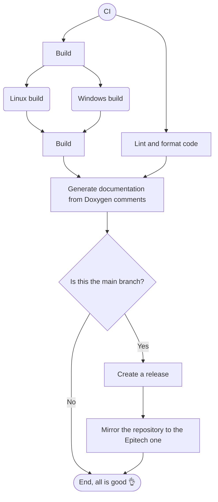

<!-- TODO: move to wiki -->

```mermaid
flowchart
    CI([CI])
    Linux(Linux build)
    Windows(Windows build)
    BuildAfter[Build]
    Lint[Lint and format code]
    Doxygen[Generate documentation from Doxygen comments]
    IsMain{Is this the main branch?}
    Release[Create a release]
    Mirror[Mirror the repository to the Epitech one]
    End([End, all is good 👌])

    CI --> Build
    CI --> Lint
    Build --> Linux
    Build --> Windows
    Linux --> BuildAfter
    Windows --> BuildAfter
    BuildAfter --> Doxygen
    Lint --> Doxygen
    Doxygen --> IsMain
    IsMain -->|Yes| Release
    IsMain -->|No| End
    Release --> Mirror
    Mirror --> End
```
