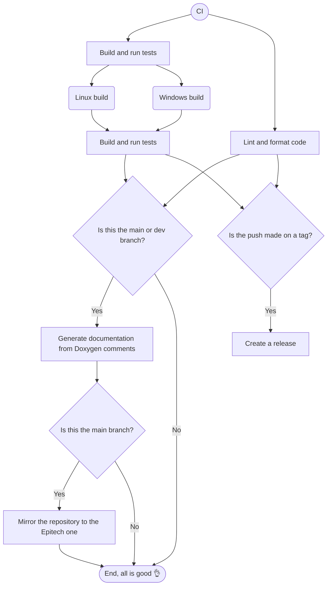

<!-- TODO: move to wiki -->

# Workflows

## Overview

This directory (`.github/workflows/`) contains the GitHub Actions workflow files used for automating tasks in this repository. Below is a detailed overview of the workflows included and their purposes.

## Continuous Integration (CI)

### Description

The CI workflow is designed to ensure the quality and integrity of the codebase. It automatically runs tests, performs linting, and runs automated actions when code is pushed to a branch or tag.

### Trigger Events

- `push`: Runs on every push to `main` or any branch or to a tag.

### Key Jobs

1. **Build (and run tests)**: Setup Conan and CMake, build executables, and run tests, both for Linux and Windows. For Linux, it also check the existence and the executability of the binaries. If the push is made on a tag, two archives (one for Linux and one for Windows) are created with the built binaries to include them in the release which will then be created.
2. **Lint and format code**: Checks the codebase for style and syntax issues using [Super-Linter](https://github.com/super-linter/super-linter).
3. **Generate documentation from Doxygen comments**: If the push is made on the `main` or `dev` branch, the documentation is built from the code using Doxygen and push to a `gh-pages` branch, so it's accessible from GitHub Pages.
4. **Create a release**: If the push is made on a tag, a release is automatically created with the tag as release name and the executables (from build step archives), assets and config example in assets.
5. **Push to mirror**: If the push is made on the `main` branch, the repository is mirrored to the Epitech one.

### Workflow Schema

Below is a simplified schema of the CI workflow:

## Create a release

To create a release, create a tag named following the [Semantic Versioning](https://semver.org) format and push it. The workflows will be triggered, also the "Create a release" one, which will create a GitHub release.

> [!TIP]
> Think changing the version where it's mentioned (among others, the `CMakeLists.txt`)

## Resources
- [GitHub Actions Documentation](https://docs.github.com/en/actions)
- [Workflow Syntax Reference](https://docs.github.com/en/actions/writing-workflows/workflow-syntax-for-github-actions)
