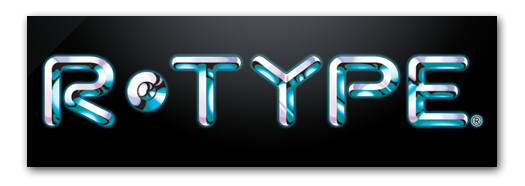

# R-Type

[](https://github.com/marketplace/actions/super-linter)

This game is informally called a Horizontal Shmup (or simply, a *Shoot’em’up*), and while **R-Type** is not the first one of its category, it has been a huge success amongst gamers in the 90’s, and had several ports, spin-offs, and 3D remakes on modern systems.

Other similar and well-known games are the **Gradius** series and **Blazing Star** on **Neo Geo**.

This project is a new version of **R-Type**, with additional features not
featured in the original game:
- It's a networked game, where several players are able to fight the evil Bydos
- Its internal design demonstrates architectural features of a real game engine

## Documentation

You can consult the documentation [here](https://github.com/Z4RM/Epitech-Tek3-CPP-R-Type/wiki).

## Tech Stack

- **Language:** C++ 17
- **Package manager:** Conan
- **Build system:** CMake

## Configuration

To configure some parts of the **R-Type** you can provide a `config.ini` file
containing specifics configuration keys.

To do this, you can copy the `config.ini.example` file to `config.ini` and
configure each key.\
All the keys and their possible values are explained in the example file.

## Run Locally

Clone the project
```bash
  git clone https://github.com/Z4RM/Epitech-Tek3-CPP-R-Type.git
```

Go to the project directory
```bash
  cd Epitech-Tek3-CPP-R-Type
```

Follow the installation steps on the wiki: [Build and manage packages](https://github.com/Z4RM/Epitech-Tek3-CPP-R-Type/wiki/Build-and-manage-packages).

Start the server and/or the client
```bash
  ./r-type_server
  ./r-type_client
```

## Contributing

Contributions are always welcome!

See [CONTRIBUTING.md](CONTRIBUTING.md) for ways to get started.
Please follow the guidelines to contribute to the project.

Please adhere to this project's [code of conduct](CODE_OF_CONDUCT.md).

## Authors

- [@Clement-Z4RM](https://github.com/Clement-Z4RM) | [@Z4RM](https://github.com/Z4RM)
- [@josephinecr](https://github.com/josephinecr)
- [@MathisZUCCHERO](https://github.com/MathisZUCCHERO)
- [@pablo-1610](https://github.com/pablo-1610)
- [@RemFdz](https://github.com/RemFdz)

## Support

For support, you can [open an issue](https://github.com/Z4RM/Epitech-Tek3-CPP-R-Type/issues/new/choose).

## License

[GNU GPL](https://choosealicense.com/licenses/gpl-3.0)

See [LICENSE](LICENSE) for more details.

> Ce projet est une réalisation académique créée dans le cadre d'un projet pour **Epitech**. Il n'est en aucun cas affilié ou approuvé par **Irem** ou les détenteurs des droits de "**R-Type**". Tous les éléments du projet sont conçus indépendamment, sans utiliser les ressources ou le code de l'œuvre originale.
